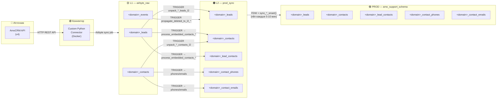

# Общая схема движения данных

## Архитектура (активная)



**Домены:** `sigmasz`, `concepta`, `entrum`

## Описание слоёв

### AmoCRM → Airbyte (Custom Python Connector)

| Параметр | Значение |
|---|---|
| **Транспорт** | HTTP REST API (AmoCRM v4) |
| **Аутентификация** | OAuth2 token, хранится в PostgreSQL (`amo_tokens`) |
| **Запуск** | Airbyte sync job (по расписанию) |
| **Rate limiting** | 0.1 сек между запросами (лимит API: 7 req/sec) |
| **Пагинация** | 250 записей на страницу |

Коннектор забирает потоки данных:
- **Инкрементальные**: `leads`, `contacts`, `events`
- **Full Refresh**: `pipelines`, `custom_fields_leads`, `custom_fields_contacts`, `users`

> Подробнее: [01_help_custom_connector.md](01_help_custom_connector.md)

---

### L1 (`airbyte_raw`) → L2 (`prod_sync`) — PostgreSQL триггеры

| Параметр | Значение |
|---|---|
| **Транспорт** | PostgreSQL `AFTER INSERT OR UPDATE` триггеры |
| **Срабатывание** | Автоматически при записи Airbyte в таблицы L1 |
| **Обработка ошибок** | Dead Letter Queue (`airbyte_raw.l2_dead_letter_queue`) |
| **Защита от «призраков»** | Tombstone Shield (`prod_sync.deleted_entities_log`) |
| **Домены** | sigmasz, concepta, entrum |

Триггеры (на примере sigmasz, аналогично для каждого домена):
1. `trg_unpack_sigmasz_leads_l2` → `airbyte_raw.unpack_sigmasz_leads_l2()`
2. `trg_unpack_sigmasz_contacts_l2` → `airbyte_raw.unpack_sigmasz_contacts_l2()`
3. `trg_propagate_deleted_to_l2` → `airbyte_raw.propagate_deleted_to_l2()`

Новые домены добавляются автоматически через event trigger `trg_auto_provision_domain`.

> Подробнее: [02_help_L1_triggers.md](02_help_L1_triggers.md)

---

### L2 (`prod_sync`) → PROD (`amo_support_schema`) — FDW + n8n

| Параметр | Значение |
|---|---|
| **Транспорт** | PostgreSQL FDW (Foreign Data Wrapper) |
| **Запуск** | n8n workflow → SQL вызов `sync_*_smart()` каждые 5–10 минут |
| **Стратегия** | Гибридная: Ghost Busting (раз в час) + Инкремент (5–10 мин) |
| **Защита** | Advisory lock, Safety check, `updated_at` сравнение |

Вызов из n8n:
```sql
SELECT * FROM amo_support_schema.sync_sigmasz_smart();
SELECT * FROM amo_support_schema.sync_concepta_smart();
SELECT * FROM amo_support_schema.sync_entrum_smart();
```

> Подробнее: [03_help_L2_L3_sync.md](03_help_L2_L3_sync.md)

---

## Полная цепочка (текстовая)

```
AmoCRM API
    │
    ▼  (HTTP REST, OAuth2 token из PG)
Custom Python Connector (Docker в Airbyte)
    │
    ▼  (Airbyte sync job → записывает в PG)
airbyte_raw (L1) — сырые данные (sigmasz / concepta / entrum)
    │
    ▼  (PostgreSQL AFTER INSERT/UPDATE триггеры — мгновенно)
prod_sync (L2) — нормализованные таблицы (sigmasz / concepta / entrum)
    │
    └──▶ amo_support_schema (PROD) — копия на другом сервере
            (FDW + PG функция sync_*_smart(), запускается через n8n каждые 5-10 мин)
```

## Канонические SQL файлы

| Файл | Назначение | Где запускать |
|---|---|---|
| `sql/00_bootstrap_schemas_and_tables.sql` | Схемы `prod_sync`, `analytics`; таблицы L2 для sigmasz; вспомогательные функции | Analytics-сервер |
| `sql/01_rebuild_functions_and_triggers_static.sql` | Tombstone Shield, DLQ, триггеры и функции L1→L2 для всех доменов | Analytics-сервер |
| `sql/02_prod_fdw_sync.sql` | Функции `sync_*_smart()` для FDW-синхронизации L2→PROD | PROD-сервер |

Архивные (устаревшие) скрипты находятся в `sql/archive/` и `docs/archive/`.

