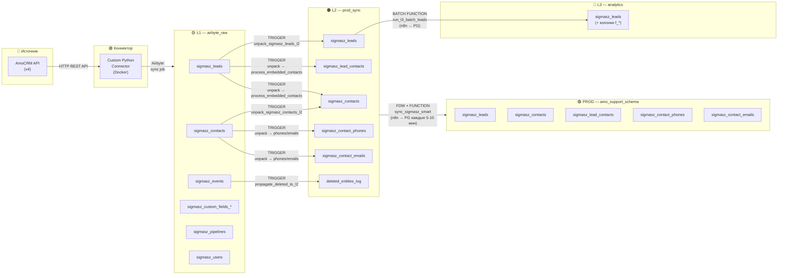

# Общая схема движения данных

## Блок-схема



## Описание слоёв

### AmoCRM → Airbyte (Custom Python Connector)

| Параметр | Значение |
|---|---|
| **Транспорт** | HTTP REST API (AmoCRM v4) |
| **Аутентификация** | OAuth2 token, хранится в PostgreSQL (`amo_tokens`) |
| **Запуск** | Airbyte sync job (по расписанию) |
| **Rate limiting** | 0.1 сек между запросами (лимит API: 7 req/sec) |
| **Пагинация** | 250 записей на страницу |

Коннектор забирает 7 потоков данных:
- **Инкрементальные**: `leads`, `contacts`, `events`
- **Full Refresh**: `pipelines`, `custom_fields_leads`, `custom_fields_contacts`, `users`

> Подробнее: [01_help_custom_connector.md](01_help_custom_connector.md)

---

### L1 (`airbyte_raw`) → L2 (`prod_sync`) — PostgreSQL триггеры

| Параметр | Значение |
|---|---|
| **Транспорт** | PostgreSQL `AFTER INSERT OR UPDATE` триггеры |
| **Срабатывание** | Автоматически при записи Airbyte в таблицы L1 |
| **Обработка ошибок** | Dead Letter Queue (`l2_dead_letter_queue`) |
| **Защита от «призраков»** | Tombstone Shield (`deleted_entities_log`) |

Триггеры:
1. `trg_unpack_sigmasz_leads_l2` — распаковка лидов + встроенных контактов
2. `trg_unpack_sigmasz_contacts_l2` — распаковка контактов + телефонов/emails
3. `trg_propagate_deleted_to_l2` — маркировка удалённых сущностей

> Подробнее: [02_help_L1_triggers.md](02_help_L1_triggers.md)

---

### L2 (`prod_sync`) → L3 (`analytics`) — Batch-функции

| Параметр | Значение |
|---|---|
| **Транспорт** | PG функция `run_l3_batch_leads()` |
| **Запуск** | n8n workflow → HTTP вызов PG функции |
| **Стратегия** | Composite watermark (`_synced_at`, `lead_id`) |
| **Batch size** | 1000 лидов по умолчанию |

Функция обогащает лиды данными контактов и разворачивает кастомные поля (`f_*`) в плоскую таблицу.

---

### L2 (`prod_sync`) → PROD (`amo_support_schema`) — FDW + n8n

| Параметр | Значение |
|---|---|
| **Транспорт** | PostgreSQL FDW (Foreign Data Wrapper) |
| **Запуск** | n8n workflow → SQL вызов `sync_sigmasz_smart()` каждые 5–10 минут |
| **Стратегия** | Гибридная: Ghost Busting (раз в час) + Инкремент (5–10 мин) |
| **Защита** | Advisory lock, Safety check, Updated_at сравнение |

> Подробнее: [03_help_L2_L3_sync.md](03_help_L2_L3_sync.md)

---

## Полная цепочка (текстовая)

```
AmoCRM API
    │
    ▼  (HTTP REST, OAuth2 token из PG)
Custom Python Connector (Docker в Airbyte)
    │
    ▼  (Airbyte sync job → записывает в PG)
airbyte_raw (L1) — сырые данные
    │
    ▼  (PostgreSQL AFTER INSERT/UPDATE триггеры — мгновенно)
prod_sync (L2) — нормализованные таблицы
    │
    ├──▶ analytics (L3) — плоская таблица с развёрнутыми f_* полями
    │       (PG функция run_l3_batch_leads, запускается через n8n)
    │
    └──▶ amo_support_schema (PROD) — копия на другом сервере
            (FDW + PG функция sync_sigmasz_smart, запускается через n8n)
```

## Файлы проекта

| Файл / Папка | Назначение |
|---|---|
| `source_amo_custom/` | Python код кастомного коннектора |
| `sql/dwh_sync_l1_l2_l3.sql` | Триггеры L1→L2, batch-функции L2→L3 |
| `sql/fdw_sync_functions.sql` | FDW синхронизация L2→PROD |
| `sql/00_bootstrap_schemas_and_tables.sql` | Создание схем и таблиц |
| `sql/add_missing_f_columns.sql` | Миграция колонок f_* для L3 |
| `Dockerfile` + `build.sh` | Сборка Docker-образа коннектора |
