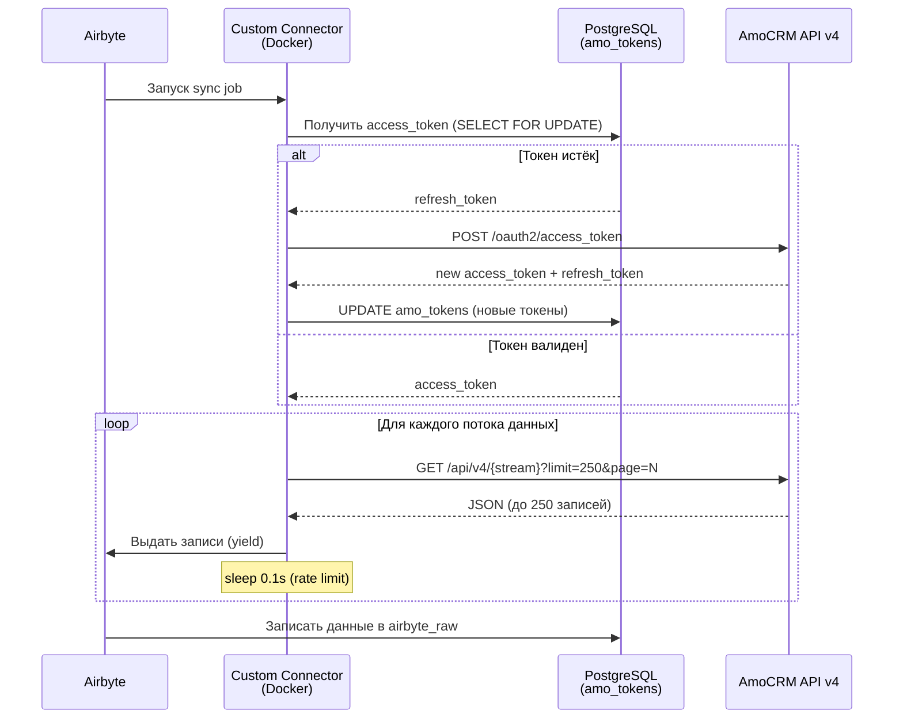

# Help: Custom Python Connector (AmoCRM → Airbyte)

## Что это

Кастомный Python-коннектор для Airbyte, который забирает данные из AmoCRM API v4 и записывает их в PostgreSQL. Работает как Docker-контейнер внутри Airbyte.

## Схема работы



## Структура файлов

```
source_amo_custom/
├── __init__.py               # Точка входа (AirbyteEntrypoint)
├── source.py                 # Главный класс + определения потоков
├── base_stream.py            # Базовые классы HttpStream
├── incremental_stream.py     # Логика инкрементальной синхронизации
├── token_manager.py          # OAuth2 — менеджер токенов через PG
├── schemas.py                # JSON Schema для каждого потока
├── spec.py                   # Спецификация коннектора (Airbyte UI)
└── constants.py              # Константы (лимиты, задержки, пороги)
```

## Список классов и функций

### `source.py` — Главный модуль

| Класс / Функция | Описание |
|---|---|
| `SourceAmoCustom` | Главный класс коннектора. Реализует `AbstractSource` |
| `SourceAmoCustom.spec()` | Возвращает спецификацию для UI Airbyte |
| `SourceAmoCustom.check_connection()` | Проверяет подключение к PostgreSQL и AmoCRM |
| `SourceAmoCustom.streams()` | Создаёт и возвращает список из 7 потоков |
| `Leads` | Поток сделок. Инкрементальный, cursor = `updated_at`, primary key = `id` |
| `Contacts` | Поток контактов. Инкрементальный, cursor = `updated_at` |
| `Events` | Поток событий удаления. Фильтрует `lead_deleted` и `contact_deleted` |
| `Pipelines` | Воронки продаж. Full Refresh, без пагинации |
| `CustomFieldsLeads` | Описание кастомных полей сделок. Full Refresh |
| `CustomFieldsContacts` | Описание кастомных полей контактов. Full Refresh |
| `Users` | Пользователи AmoCRM. Full Refresh |

### `base_stream.py` — Базовые классы

| Класс / Метод | Описание |
|---|---|
| `AmoStream` | Базовый HTTP-стрим. Устанавливает `url_base`, `request_headers`, `should_retry`, `backoff_time`, `next_page_token`, `parse_response` |
| `AmoStream.request_headers()` | Добавляет `Authorization: Bearer {token}` |
| `AmoStream.should_retry()` | Retry при 401 (сброс токена), 429 (rate limit), 5xx |
| `AmoStream.backoff_time()` | Задержка: 10 сек (429), 20 сек (5xx), 1 сек (401) |
| `AmoStream.next_page_token()` | Пагинация: если получено 250 записей → следующая страница |
| `AmoStream.parse_response()` | Парсит JSON, sleep 0.1 сек для rate limit |
| `AmoFullRefreshStream` | Для справочников: одна страница, без фильтров по дате |

### `incremental_stream.py` — Инкрементальная логика

| Метод | Описание |
|---|---|
| `state` (getter/setter) | Управление cursor. В full-load режиме сохранённый state игнорируется |
| `get_updated_state()` | Обновляет cursor = `max(текущий, latest_record)` |
| `_get_start_timestamp()` | Вычисляет начальный timestamp с overlap-окном (600 сек назад) |
| `_is_full_load_mode()` | `True` если `start_date == 0` |
| `_build_incremental_params()` | Параметры запроса: `filter[cursor][from]=start`, `order[cursor]=asc` |
| `_build_full_load_params()` | Параметры запроса: `order[id]=asc`, без фильтра по дате |

### `token_manager.py` — Менеджер OAuth2

| Метод | Описание |
|---|---|
| `DatabaseTokenManager.__init__()` | Принимает `db_config` и `domain` |
| `invalidate_memory_token()` | Сбрасывает кешированный токен в памяти при 401 |
| `get_valid_token()` | Получает токен из PG с блокировкой `FOR UPDATE`. Если истёк (< 5 мин до expiry) — обновляет через AmoCRM OAuth API |
| `_refresh_in_amo()` | POST запрос к AmoCRM OAuth2 для обновления `refresh_token` → `access_token` |

### `schemas.py` — JSON Schema

| Функция | Описание |
|---|---|
| `get_leads_schema()` | Схема сделки: id, name, price, status_id, pipeline_id, custom_fields_values, _embedded |
| `get_contacts_schema()` | Схема контакта: id, name, first_name, last_name, custom_fields_values |
| `get_events_schema()` | Схема события: id, type, entity_id, entity_type |
| `get_pipelines_schema()` | Схема воронки: id, name, _embedded.statuses |
| `get_custom_fields_schema()` | Описание кастомного поля: id, name, type, enums |
| `get_users_schema()` | Схема пользователя: id, name, email |

### `constants.py` — Константы

| Константа | Значение | Описание |
|---|---|---|
| `FULL_LOAD_THRESHOLD` | `0` | Порог: `start_date=0` → полная загрузка |
| `MAX_RECORDS_PER_PAGE` | `250` | Лимит AmoCRM API |
| `RATE_LIMIT_DELAY_SECONDS` | `0.1` | Задержка между запросами |
| `OVERLAP_SECONDS` | `600` | Окно перезагрузки для consistency |
| `BACKOFF_RATE_LIMIT` | `10.0` | Backoff при 429 |
| `BACKOFF_SERVER_ERROR` | `20.0` | Backoff при 5xx |
| `BACKOFF_UNAUTHORIZED` | `1.0` | Backoff при 401 |

---

## Режимы синхронизации

### Full Load (`start_date = 0` или не задан)
- Загружает **все** записи без фильтров по дате
- Сортировка: `order[id]=asc`
- Сохранённый cursor **игнорируется**

### Incremental (`start_date > 0`)
- Загружает записи с `updated_at >= start_date`
- Использует cursor для отслеживания прогресса
- Overlap 600 сек — перезагружает последние 10 минут для eventual consistency
- Дубликаты обрабатываются Airbyte через dedup по primary key

---

## Конфигурация (Airbyte UI)

| Параметр | Тип | Обязательный | Описание |
|---|---|---|---|
| `domain` | string | ✅ | Субдомен AmoCRM (например, `mycompany`) |
| `client_id` | string | ✅ | ID интеграции |
| `client_secret` | string (secret) | ✅ | Секретный ключ |
| `db_host` | string | ✅ | Хост PostgreSQL |
| `db_port` | integer | ✅ | Порт (по умолчанию 5433) |
| `db_name` | string | ✅ | Имя базы данных |
| `db_user` | string | ✅ | Пользователь БД |
| `db_password` | string (secret) | ✅ | Пароль БД |
| `start_date` | integer | ❌ | Unix timestamp (0 = полная загрузка) |
