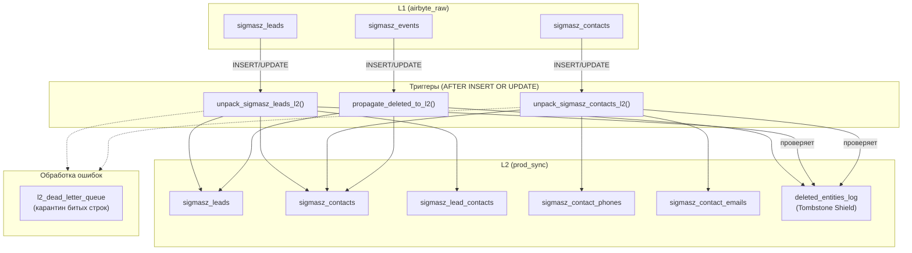

# Help: L1 Триггеры (airbyte_raw → prod_sync)

## Что это

Автоматические PostgreSQL триггеры, которые срабатывают при записи данных из Airbyte в слой L1 (`airbyte_raw`). Каждый триггер распаковывает «сырые» записи в нормализованные таблицы слоя L2 (`prod_sync`).

## Схема работы



## Файл исходного кода

📄 [dwh_sync_l1_l2_l3.sql](../sql/dwh_sync_l1_l2_l3.sql)

---

## Инфраструктурные таблицы (BLOCK 0)

| Таблица | Описание |
|---|---|
| `prod_sync.deleted_entities_log` | **Tombstone Shield** — реестр удалённых сущностей. PK: `(entity_type, entity_id)`. Проверяется перед любым UPSERT в L2 |
| `airbyte_raw.l2_dead_letter_queue` | **Dead Letter Queue** — карантин для записей, вызывающих ошибки. Содержит `raw_record`, `error_message`, `sqlstate` |
| `prod_sync.l3_batch_watermarks` | Водяные метки для L3-батчей. Composite watermark: `(last_synced_at, last_entity_id)` |

---

## Вспомогательные функции (BLOCK 1–2)

| Функция | Описание |
|---|---|
| `prod_sync.register_tombstone(entity_type, entity_id)` | Регистрирует удаление сущности в `deleted_entities_log` (UPSERT) |
| `prod_sync.is_tombstoned(entity_type, entity_id)` | Проверяет, находится ли сущность в реестре удалённых |
| `prod_sync.safe_cf_to_timestamp(val)` | Безопасная конвертация строки в `TIMESTAMPTZ`. Поддерживает Unix timestamp (10/13 цифр) |
| `prod_sync.get_best_contact_for_lead(lead_id)` | Возвращает «лучший» контакт для лида: `is_main=TRUE` приоритетнее, иначе минимальный `contact_id`. Возвращает `(c_id, c_name, c_phone, c_email)` |
| `public.normalize_phone(p_raw)` | Нормализация телефона: оставляет только цифры, `8` → `7` для РФ/СНГ |

---

## Триггерные функции (BLOCK 3)

### 1. `airbyte_raw.propagate_deleted_to_l2()` — Tombstone Writer

**Триггер**: `trg_propagate_deleted_to_l2` на `airbyte_raw.sigmasz_events`

**Логика**:
1. Если событие `lead_deleted` → регистрирует tombstone + ставит `is_deleted=TRUE` в `prod_sync.sigmasz_leads`
2. Если событие `contact_deleted` → регистрирует tombstone + ставит `is_deleted=TRUE` в `prod_sync.sigmasz_contacts`
3. При ошибке — `RAISE WARNING` (не блокирует транзакцию)

---

### 2. `airbyte_raw.unpack_sigmasz_leads_l2()` — Распаковщик лидов

**Триггер**: `trg_unpack_sigmasz_leads_l2` на `airbyte_raw.sigmasz_leads`

**Логика**:
1. Проверяет `id` (не NULL) и Tombstone Shield (не удалён?)
2. Если `is_deleted=TRUE` → регистрирует tombstone, помечает в L2, выходит
3. Конвертирует `created_at` и `updated_at` в `TIMESTAMPTZ` (через `safe_cf_to_timestamp`)
4. Безопасно парсит `_embedded` (JSONB object) и `custom_fields_values` (JSONB array)
5. Собирает `raw_json` — объединение ключевых полей для хранения в L2
6. Выполняет `INSERT ... ON CONFLICT DO UPDATE` в `prod_sync.sigmasz_leads`
7. Обрабатывает `_embedded.contacts` → вызывает `process_embedded_contacts()`
8. **При ошибках данных** (bad data) → записывает в DLQ, `RAISE WARNING`
9. **При транзиентных ошибках** → `RAISE EXCEPTION` (Airbyte повторит)

---

### 3. `airbyte_raw.unpack_sigmasz_contacts_l2()` — Распаковщик контактов

**Триггер**: `trg_unpack_sigmasz_contacts_l2` на `airbyte_raw.sigmasz_contacts`

**Логика**:
1. Проверяет `id` и Tombstone Shield
2. Если `is_deleted=TRUE` → tombstone + помечает в L2
3. Конвертирует `updated_at`, парсит `custom_fields_values`
4. `INSERT ... ON CONFLICT DO UPDATE` в `prod_sync.sigmasz_contacts`
5. Извлекает **телефоны** из кастомных полей (`field_code = 'PHONE'`):
   - Нормализует через `normalize_phone()`
   - Фильтрует: длина ≥ 10 цифр
   - Пересоздаёт все телефоны для контакта (DELETE + INSERT)
6. Извлекает **emails** (`field_code = 'EMAIL'`):
   - Приводит к lower case, trim
   - Пересоздаёт все emails для контакта
7. Ошибки → DLQ / RAISE EXCEPTION

---

## Утилитарные функции (BLOCK 4)

### `prod_sync.process_embedded_contacts(p_contacts_json, p_lead_id, p_explicit_empty)`

Обрабатывает массив контактов из `_embedded.contacts` лида:

1. Если `p_explicit_empty=TRUE` (пустой массив) → удаляет все связи лида с контактами
2. Для каждого контакта в JSON:
   - Проверяет Tombstone Shield
   - UPSERT в `prod_sync.sigmasz_contacts`
   - UPSERT в `prod_sync.sigmasz_lead_contacts` (с полем `is_main`)
3. Удаляет старые связи: контакты, которых нет в новом JSON

---

## Триггеры DDL (BLOCK 7)

| Триггер | Таблица | Функция |
|---|---|---|
| `trg_unpack_sigmasz_leads_l2` | `airbyte_raw.sigmasz_leads` | `unpack_sigmasz_leads_l2()` |
| `trg_unpack_sigmasz_contacts_l2` | `airbyte_raw.sigmasz_contacts` | `unpack_sigmasz_contacts_l2()` |
| `trg_propagate_deleted_to_l2` | `airbyte_raw.sigmasz_events` | `propagate_deleted_to_l2()` |
| `trg_update_lead_on_contact_link_change` | `prod_sync.sigmasz_lead_contacts` | `trg_update_lead_on_contact_change()` |

> **`trg_update_lead_on_contact_change()`** — при изменении связи «лид↔контакт» обновляет `_synced_at` у лида. Это гарантирует, что L3-батч подхватит лид при изменении контактных данных.

---

## Индексы (BLOCK 8)

| Индекс | Таблица | Колонки | Назначение |
|---|---|---|---|
| `idx_sigmasz_leads_composite_wm` | `prod_sync.sigmasz_leads` | `(_synced_at, lead_id)` | Composite watermark для L3-батчей |
| `idx_sigmasz_contacts_composite_wm` | `prod_sync.sigmasz_contacts` | `(_synced_at, contact_id)` | Composite watermark |
| `idx_dlq_active_entity` | `l2_dead_letter_queue` | `(stream_name, entity_id) WHERE resolved=FALSE` | Уникальный для ON CONFLICT в DLQ |
| `idx_sigmasz_leads_is_deleted` | `prod_sync.sigmasz_leads` | `(is_deleted) WHERE TRUE` | Быстрый поиск удалённых |
| `idx_sigmasz_contacts_is_deleted` | `prod_sync.sigmasz_contacts` | `(is_deleted) WHERE TRUE` | Быстрый поиск удалённых |

---

## Views для мониторинга (BLOCK 9)

| View | Описание |
|---|---|
| `airbyte_raw.v_dlq_summary` | Агрегация ошибок DLQ: `stream_name`, `total_errors`, `unresolved`, даты |
| `prod_sync.v_batch_status` | Статус L3-батчей: `last_synced_at`, `pending_rows`, `lag_minutes`, `dlq_unresolved` |
| `prod_sync.v_recent_tombstones` | Последние 100 удалённых сущностей |

---

## Диагностика

```sql
-- Сколько ошибок в DLQ?
SELECT * FROM airbyte_raw.v_dlq_summary;

-- Статус L3 батча?
SELECT * FROM prod_sync.v_batch_status;

-- Последние удаления?
SELECT * FROM prod_sync.v_recent_tombstones;

-- Неразрешённые ошибки?
SELECT * FROM airbyte_raw.l2_dead_letter_queue WHERE resolved = FALSE ORDER BY failed_at DESC;
```
