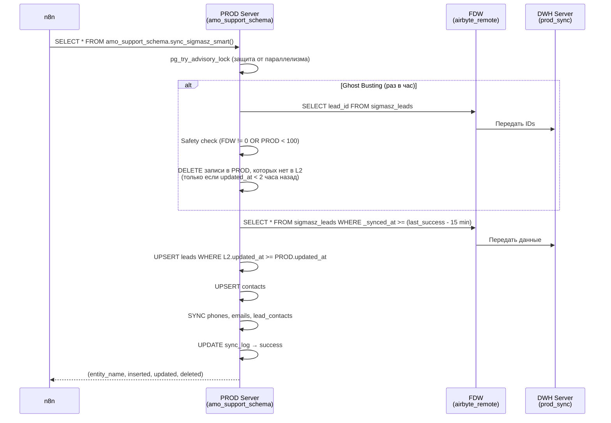

# Help: L2 → PROD (FDW Синхронизация)

## Что это

Активный production-контур проекта доставляет данные из нормализованного слоя L2 (`prod_sync`) в `amo_support_schema` на другом PostgreSQL-сервере через FDW.

Исторические материалы про L2 → L3 (`analytics`) вынесены в архив и не относятся к текущему canonical deployment.

---

## Схема работы

### Схема работы



### Файл исходного кода

📄 [02_prod_fdw_sync.sql](../sql/02_prod_fdw_sync.sql)

---

### Функции

#### `amo_support_schema.sync_sigmasz_smart()` — Главная функция синхронизации

**Вызов**: `SELECT * FROM amo_support_schema.sync_sigmasz_smart();`

**Режимы**:

| Режим | Частота | Описание |
|---|---|---|
| `smart_ghost` | Раз в час | Ghost Busting — удаление «призраков» из PROD |
| `smart_inc` | Каждые 5–10 мин | Инкрементальная синхронизация изменённых записей |

**Алгоритм**:

| Шаг | Описание |
|---|---|
| 1 | `pg_try_advisory_lock` — защита от параллельного запуска |
| 2 | Вычисляет `v_from_ts` = последний успешный запуск − 15 мин (overlap) |
| 3 | Определяет, нужен ли Ghost Busting (прошло > 1 часа?) |
| 4 | **Ghost Busting**: скачивает только IDs из L2, удаляет записи PROD, которых нет в L2 и старше 2 часов |
| 5 | **Safety Check**: если FDW вернул 0 записей, а PROD содержит > 100 → ABORT (защита от FDW сбоя) |
| 6 | **Инкремент**: материализует изменённые записи в temp-таблицы |
| 7 | UPSERT лидов и контактов с проверкой `updated_at >= PROD.updated_at` |
| 8 | Синхронизирует связанные данные (phones, emails, lead_contacts) |
| 9 | Логирует результат в `sync_log` |

**Возвращает**: таблицу `(entity_name, inserted, updated, deleted)` — по строке на каждую сущность.

**Защитные механизмы**:

| Механизм | Описание |
|---|---|
| Advisory Lock | Предотвращает параллельный запуск |
| Safety Check | Не удаляет данные если FDW вернул 0 записей |
| Updated_at guard | Не перезаписывает более свежие данные из webhook |
| 2-часовое окно | Не трогает записи моложе 2 часов при Ghost Busting |
| 15-минутный overlap | Перекрытие между запусками для надёжности |
| FDW Pushdown fallback | Если массив > 5000 → full scan вместо = ANY() |

---

### Таблица логов

#### `amo_support_schema.sync_log`

| Колонка | Описание |
|---|---|
| `sync_type` | `'smart_ghost'` / `'smart_inc'` |
| `status` | `'running'` / `'success'` / `'error'` |
| `started_at`, `finished_at` | Временные метки |
| `leads_inserted/updated/deleted` | Счётчики по лидам |
| `contacts_ins/upd/del` | Счётчики по контактам |
| `phones_ins`, `emails_ins`, `links_ins` | Счётчики по связям |
| `error_message` | Текст ошибки (при `status='error'`) |

---

## Диагностика

```sql
-- Последние запуски FDW-синхронизации
SELECT * FROM amo_support_schema.sync_log ORDER BY started_at DESC LIMIT 10;

-- Есть ли ошибки в FDW-синхронизации?
SELECT * FROM amo_support_schema.sync_log WHERE status = 'error' ORDER BY started_at DESC;

-- Ручной запуск FDW-синхронизации
SELECT * FROM amo_support_schema.sync_sigmasz_smart();
```

---

## n8n Интеграция

### FDW Smart Sync (n8n → PG)

```
HTTP Request → PostgreSQL:
  Query: SELECT * FROM amo_support_schema.sync_sigmasz_smart();
  Frequency: каждые 5–10 минут
  Ghost Busting: автоматически раз в час
```
