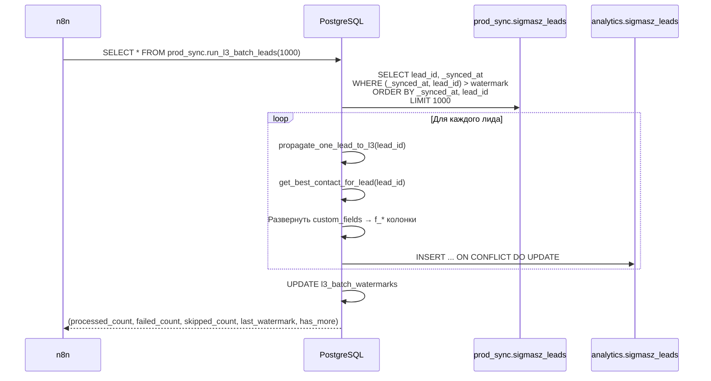
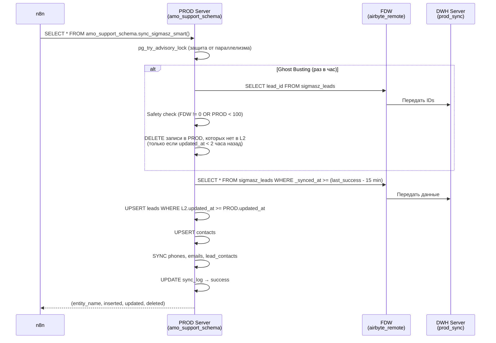

# Help: L2 → L3 и L2 → PROD (Синхронизация данных)

## Что это

Две параллельные ветки для доставки данных из нормализованного слоя L2 (`prod_sync`):

1. **L2 → L3** (`analytics`) — плоская таблица для аналитики, с развёрнутыми кастомными полями (`f_*`)
2. **L2 → PROD** (`amo_support_schema`) — копия данных на другой сервер PG через FDW

Обе ветки запускаются через **n8n** (HTTP-вызов PG функции).

---

## Часть 1: L2 → L3 (analytics)

### Схема работы



### Файл исходного кода

📄 [dwh_sync_l1_l2_l3.sql](../sql/dwh_sync_l1_l2_l3.sql) — BLOCK 5–6

---

### Функции

#### `prod_sync.propagate_one_lead_to_l3(p_lead_id, p_cols, p_insert_cols, p_set_clause)`

Обрабатывает один лид из L2 и записывает в L3:

| Шаг | Описание |
|---|---|
| 1 | Загружает лид из `prod_sync.sigmasz_leads` |
| 2 | Если `is_deleted=TRUE` → `DELETE` из `analytics.sigmasz_leads`, выход |
| 3 | Получает «лучший» контакт через `get_best_contact_for_lead()` |
| 4 | Разворачивает `raw_json.custom_fields_values` в плоский JSON с ключами `f_{field_id}` |
| 5 | Для полей `date`/`date_time`/`birthday` — конвертирует через `safe_cf_to_timestamp()` |
| 6 | Добавляет базовые поля: `lead_id`, `name`, `status_id`, `pipeline_id`, `price`, `contact_*` |
| 7 | Динамически строит SQL: `INSERT INTO analytics.sigmasz_leads (...) ... ON CONFLICT DO UPDATE` |
| 8 | Использует `jsonb_populate_record()` для маппинга JSON → колонки таблицы |

**Параметры `p_cols`, `p_insert_cols`, `p_set_clause`** — опциональные, кешируются в batch-функции для производительности.

---

#### `prod_sync.run_l3_batch_leads(p_batch_size, p_max_retries)`

Основная entry-point функция для запуска из n8n:

| Параметр | По умолчанию | Описание |
|---|---|---|
| `p_batch_size` | `1000` | Количество лидов за один запуск |
| `p_max_retries` | `0` | `0` = fail-stop (остановка при первой ошибке), `>0` = quarantine mode |

**Алгоритм**:
1. `SELECT FOR UPDATE` водяную метку из `l3_batch_watermarks`
2. Кеширует метаданные колонок L3 таблицы один раз
3. Забирает batch лидов: `(_synced_at, lead_id) > watermark AND _synced_at < NOW()-5s`
4. Для каждого лида вызывает `propagate_one_lead_to_l3()`
5. При ошибке:
   - **fail-stop mode** (`p_max_retries=0`) — записывает в DLQ, останавливается
   - **quarantine mode** (`p_max_retries>0`) — пропускает после N попыток
6. Обновляет watermark
7. Возвращает результат: `(processed_count, failed_count, skipped_count, last_watermark, has_more)`

**Возвращаемое значение `has_more`**:
- `TRUE` → есть ещё данные, n8n должен вызвать функцию ещё раз
- `FALSE` → данные обработаны или произошла ошибка

---

### Таблицы L3

#### `analytics.sigmasz_leads`

Плоская таблица с базовыми колонками + динамические `f_*` колонки:

| Колонка | Тип | Описание |
|---|---|---|
| `lead_id` | `BIGINT PK` | ID лида |
| `name` | `TEXT` | Название сделки |
| `status_id` | `INT` | ID статуса в воронке |
| `pipeline_id` | `INT` | ID воронки |
| `price` | `NUMERIC` | Бюджет |
| `created_at` | `TIMESTAMPTZ` | Дата создания |
| `updated_at` | `TIMESTAMPTZ` | Дата обновления |
| `is_deleted` | `BOOLEAN` | Флаг удаления |
| `_synced_at` | `TIMESTAMPTZ` | Время синхронизации в L3 |
| `contact_id` | `BIGINT` | ID основного контакта |
| `contact_name` | `TEXT` | Имя контакта |
| `contact_phone` | `TEXT` | Телефон контакта |
| `contact_email` | `TEXT` | Email контакта |
| `f_{field_id}` | `TEXT/NUMERIC/TIMESTAMPTZ/BOOLEAN` | Кастомные поля (динамические) |

> Колонки `f_*` создаются скриптом [add_missing_f_columns.sql](../sql/add_missing_f_columns.sql) на основе данных из `airbyte_raw.sigmasz_custom_fields_leads`.

---

## Часть 2: L2 → PROD (amo_support_schema) через FDW

### Схема работы



### Файл исходного кода

📄 [fdw_sync_functions.sql](../sql/fdw_sync_functions.sql)

---

### Функции

#### `amo_support_schema.sync_sigmasz_smart()` — Главная функция синхронизации

**Вызов**: `SELECT * FROM amo_support_schema.sync_sigmasz_smart();`

**Режимы**:

| Режим | Частота | Описание |
|---|---|---|
| `smart_ghost` | Раз в час | Ghost Busting — удаление «призраков» из PROD |
| `smart_inc` | Каждые 5–10 мин | Инкрементальная синхронизация изменённых записей |

**Алгоритм**:

| Шаг | Описание |
|---|---|
| 1 | `pg_try_advisory_lock` — защита от параллельного запуска |
| 2 | Вычисляет `v_from_ts` = последний успешный запуск − 15 мин (overlap) |
| 3 | Определяет, нужен ли Ghost Busting (прошло > 1 часа?) |
| 4 | **Ghost Busting**: скачивает только IDs из L2, удаляет записи PROD, которых нет в L2 и старше 2 часов |
| 5 | **Safety Check**: если FDW вернул 0 записей, а PROD содержит > 100 → ABORT (защита от FDW сбоя) |
| 6 | **Инкремент**: материализует изменённые записи в temp-таблицы |
| 7 | UPSERT лидов и контактов с проверкой `updated_at >= PROD.updated_at` |
| 8 | Синхронизирует связанные данные (phones, emails, lead_contacts) |
| 9 | Логирует результат в `sync_log` |

**Возвращает**: таблицу `(entity_name, inserted, updated, deleted)` — по строке на каждую сущность.

**Защитные механизмы**:

| Механизм | Описание |
|---|---|
| Advisory Lock | Предотвращает параллельный запуск |
| Safety Check | Не удаляет данные если FDW вернул 0 записей |
| Updated_at guard | Не перезаписывает более свежие данные из webhook |
| 2-часовое окно | Не трогает записи моложе 2 часов при Ghost Busting |
| 15-минутный overlap | Перекрытие между запусками для надёжности |
| FDW Pushdown fallback | Если массив > 5000 → full scan вместо = ANY() |

---

### Таблица логов

#### `amo_support_schema.sync_log`

| Колонка | Описание |
|---|---|
| `sync_type` | `'smart_ghost'` / `'smart_inc'` |
| `status` | `'running'` / `'success'` / `'error'` |
| `started_at`, `finished_at` | Временные метки |
| `leads_inserted/updated/deleted` | Счётчики по лидам |
| `contacts_ins/upd/del` | Счётчики по контактам |
| `phones_ins`, `emails_ins`, `links_ins` | Счётчики по связям |
| `error_message` | Текст ошибки (при `status='error'`) |

---

## Диагностика

```sql
-- Статус L3 батча
SELECT * FROM prod_sync.v_batch_status;

-- Последние запуски FDW-синхронизации
SELECT * FROM amo_support_schema.sync_log ORDER BY started_at DESC LIMIT 10;

-- Есть ли ошибки в FDW-синхронизации?
SELECT * FROM amo_support_schema.sync_log WHERE status = 'error' ORDER BY started_at DESC;

-- Ручной запуск L3-батча
SELECT * FROM prod_sync.run_l3_batch_leads(1000);

-- Ручной запуск FDW-синхронизации
SELECT * FROM amo_support_schema.sync_sigmasz_smart();
```

---

## n8n Интеграция

### L3 Batch (n8n → PG)

```
HTTP Request → PostgreSQL:
  Query: SELECT * FROM prod_sync.run_l3_batch_leads(1000);
  Frequency: каждые 5–10 минут
  Logic: если has_more=TRUE → повторить
```

### FDW Smart Sync (n8n → PG)

```
HTTP Request → PostgreSQL:
  Query: SELECT * FROM amo_support_schema.sync_sigmasz_smart();
  Frequency: каждые 5–10 минут
  Ghost Busting: автоматически раз в час
```
